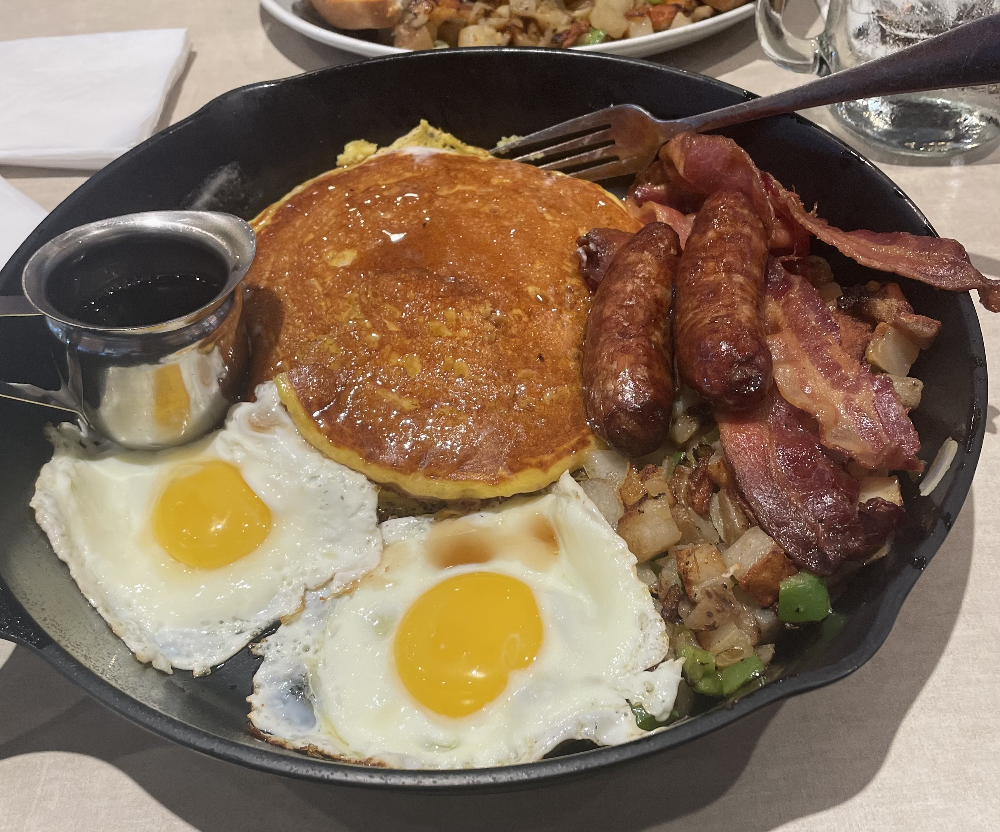

# Tommy Tran README

## About Me
Originally born and raised in Springfield, Virginia, I started my life in the DMV area. After moving to Delaware I eventually decided to go to a Vocational Tech School where I majored in carpentry. I worked on woodworking projects including cabinets,framing, and roofing. I continued my studies in carpentry for an additional 2 years before deciding on going to Delaware tech for College. I studied accounting for a time and received my associates degree. Afterwards I entered an adult learning  program where I learned HVAC. I worked in this industry for the following 2 years before finding an interest in coding.

### Learning Style
I learn best in a social setting as I can bounce ideas across other people and receive feedback on my actions immediately. I also like to have a hands on approach on subjects and prefer getting my hands dirty with experiments and role-playing scenarios. When I'm alone i like to reflect on the work that I have done and repeat challenge exercises to build up the mental repetition in my head. I struggle to figure out how to tackle problems in the beginning but feel that it gets easier once I have built once I have a solid foundation to process my ideas.

### likes

1. Music / Concerts
1. Art / Fashion
1. Traveling 

### dislikes
1. Seafood
2. bugs
3. working on Sundays

### Goals

1. Attend more music festivals and concerts and meet new people.
1. Travel to Japan and go to as many different bars and restaurant.
1. Be able to work remote anywhere in the world.

### My Favorite Past time

### Contact Information

Email:   Best form of contact for me. I try to respond as soon as possible.

Phone: I can be reached here for urgent information. If I am not available please leave a voice message

Github:  https://github.com/txtran224
 