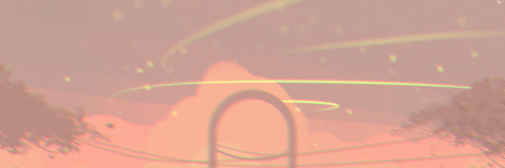

# Mya.README 
*I’m HS graduate learning to adult in this world - starting with improving my skills. 
I’ve been with code differently as a jr developer intern since 2020! Coding isn't completely new but I still need to refresh my memory.   I'll figure it out*  ദ്ദി(˵ •̀ ᴗ - ˵ ) ✧

⚠︎ .ᐟ.ᐟ "...I'm the type of person that if you ask me a question and I don't know the answer, I'm gonna tell you that I don't know. But I bet you what, I know how to find the answer and I will find the answer." - Will smith

### ☴ My work hours
<code style="color : aquamarine">9AM-5PM</code> However you will most likely catch me outside of those hours if you need any help. 
When i'm out on vacation or absent, I will be offline until my return.

### What's the best way to communicate with me? .☘︎ ݁˖
A private message through google chat works perfectly. One of the fastest ways to reach me! 
Email works too as a follow up or if that's what you prefer, either one is fine. In case I don't respond: ping me again on google chat.
A reminder as well, please don't worry or apologize about reaching out - that's my thing. 

### I'd be happy to help you with ꒰ ﹍ ꒱
* Code suggestions
* Explain or understand a code snippet
* Photos + design ideas 

## Extra  ⓘ
  ✦ procreate artist ↓  
  ###### I like to combine this with my coding  work! In case you find me with my ipad, that's why. 
* visual learner  
* Outside coding experience on toyhou.se
* early bird ➜ Not on purpose, and no I don't drink coffee.

        ┆ 𝙻𝚒𝚔𝚎𝚜:: nintendo (e.g. tomodachi life, animal crossing) , drawing, designing my code, meeting others 
        ┆ 𝙳𝚒𝚜𝚕𝚒𝚔𝚎𝚜:: missing out on info, overthinking only to end up finding a much easier solution ᴖ̈

###### // readme inspired by [Kaeti's repo][kaeti-repo]

[kaeti-repo]: https://github.com/kaeti/personal-readme
