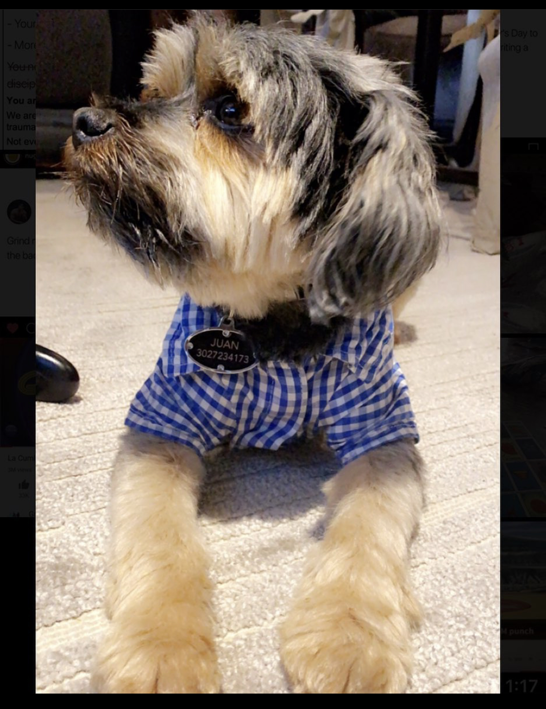

## Angelica Castillo 
* Angelica is the daughter of immmigrant parents. She is 1 of 6 children. She has worked in retail and has expirience working in Early Childhood Education. Taught at Wilmington Head Start, Bush Early Education, & Mount Pleasant Elementary. Angelica is persuing a software development carrear at Code Differently.

### Get to know me
 I am a nature person. I enjoy any outdoor activity. Love going on walks, outdoor runs, & hikes. I am definitely a morning person. Getting up early exercising and getting  ready for the day. Makes the day be more productive for me. On my down time I enjoy watching animal planet and Discovery ID. I love to travel and get to know as many new countries as possible.

### Fun facts
I am bilingual. Being fluent in reading, writting, and speaking Spanish and English. I have a pet whose name is Neeko. Enjoy spending time wiht him and taking him on long walks. I value family and love to spend time with them. I travel to Mexico to visit family and celebrate memorable holidays with them. 
 

	
### How do I like to give feedback?
It is more personal for me to give feedback in person. If preferred via email is another option. 

### How do I like to receive feedback?
 I like to receive feedback in person. It is more personal expirience. It allows me to be more present in the conversation, and I get to have real time answers to the questions I may have. 

### One of my goals for the coming year:
I would like complete the Code Differently program. short after, land a job in Software development. 
Furthermore, I would want to go scuba diving and skydiving. 

### Topics I’m always happy to talk about:
Dogs, nature, healthy lifestyle, and anything that people may want to talk about. 

### Other things you might want to know:

* My favorite: Oatmeal cookies 
* pets: 1 dog/ Neeko. 
* 4 brothers 1 sister.
* Favorite fruit: Watermelon
* My tea order: Iced chai latte with almond milk.
 

### Meet Neeko!
 