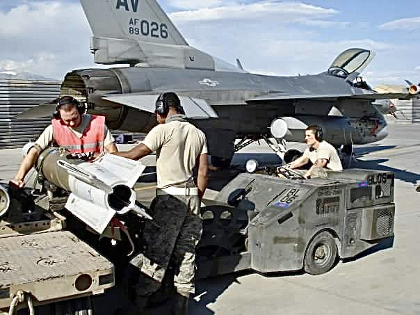
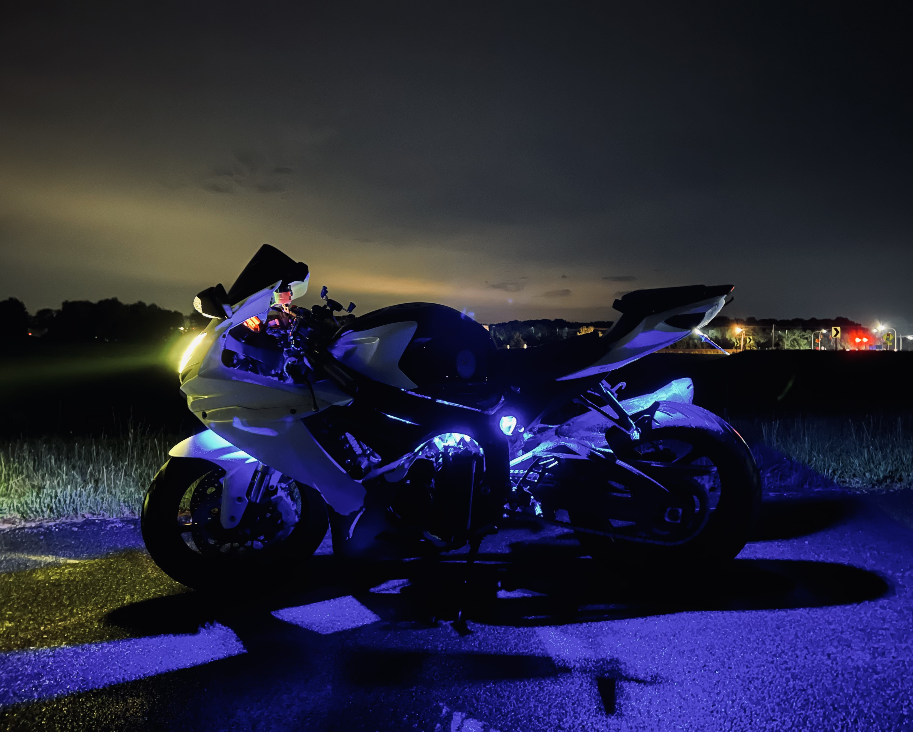
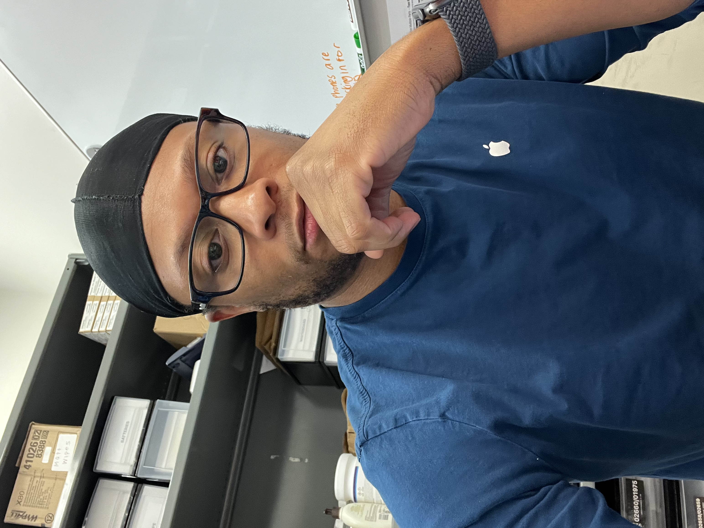

# Benjamin M. Young README

# Introduction 

Hello i'm Benjamin. I am a United States Airforce Veteran of 4 years ,and former Apple technical expert, with 5 years of experience troubleshooting ios, and repairing iphones . I consider myself a world traveller, adrenaline junkie, amateur investor, and a jack of all trades master of none.

## Prerequisites 

These are some of the things that i need to be the most productive, and successful.

* At least 8 hours of uninterrupted sleep, or i may be cranky.
* Socializaton with my core friends either virtually, on the phone, or in person 
* Exercise to help clear my mind, and maintain health.
* Sunday GI party aka cleaning, blasting music, and getting ready for the work week
* A good meal

## Installation Instructions 

1. The best time to reach me is going to be after 5pm EST throughout the week, and after 9am on weekends 
1. I may look unapproachable, but i assure you that i am just ask.
1. The way that I learn best is a mixture of reading and being hands on.

## How to contact me

* I can be found in class, in the google chat, or on linkedin.

## Fun facts 

* I have a natural talent for motorsports you can catch me on the track.
* I am an aviaton geek, licensed UAS pilot, and student pilot 

# Photo Gallery 

