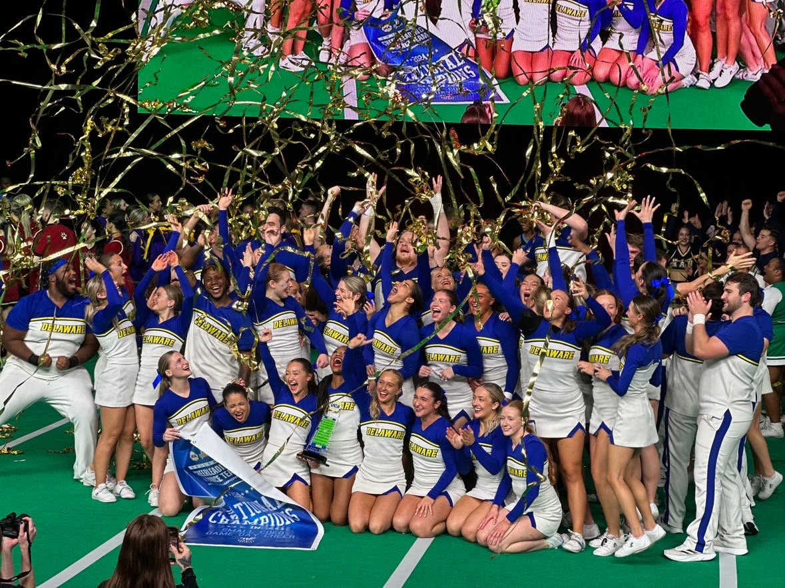

# Dasia English 

## Get to know me :)

Hello everyone! I am excited to be in this program and further my education in tech. I graduated from the University of Delaware majoring in Entrepreneurship, and minored in Disability Studies. Not to mention I was on the Coed Cheer team and named captain my Senior year. I have 19 years of experience in cheerleading. With that experience, I also have won a lot of cool things in those years. My most recent accomplishment is being a 4x Collegiate Champion in a row.

## 2024 Game Day Champions (6peat)

 

## Current jobs 

1. First State Gymnastics
    * Insructor/Front Desk
1. M.O.T All Stars 
    * Coaching a Mini level 1 prep Team
1. Odessa High School Cheer Coach 
    * JV Cheer Team
1. Private Lessons (Personal business)
    * Tumbling, stretching, and Jump 1-on-1's

## Support 

I am a hands-on-learner. I also learn from constructive feedback. I like to know when I am wrong. Mainly because I want to continuously make myself better. I also like to get credit when my credit is due.

## Contact me 

I am available from 9am-9pm. The best time is before 12pm

## Goals for the coming Year

Finding my career job in Tech. I also would like my cheerleading team to be undefeated. 

## Important to know 

* When I am doing work I rather not get interrupted because I will lose my train of thought. I would appreciate if people would wait until I am finished to talk to me. 
* Time management is big for me 
* I have to be organized in order for me to be my most productive self

# What will get me talking 

* I love talking about cheerleading. Like I said before I have been doing cheerleading since I was 3 years old. I have not stopped since. 
* I enjoy talking about clothing and shopping. I have so many clothes. I love going to the mall. I also enjoy going to the mall. I did have to take a pause on shopping because I am starting to not have anywhere to put my clothes. 
* I have torn my ACL and I love to relate to people in this way and give them encouragement on the 9 month process. I know how it feels to have to take a step back from doing things how you normally do them and having to adapt to your new life. 
* I also like to talk about cheerleading skills. I enjoy spreading my knowledge and helping people achieve skills that I already know. I get pride and joy from doing so. 
