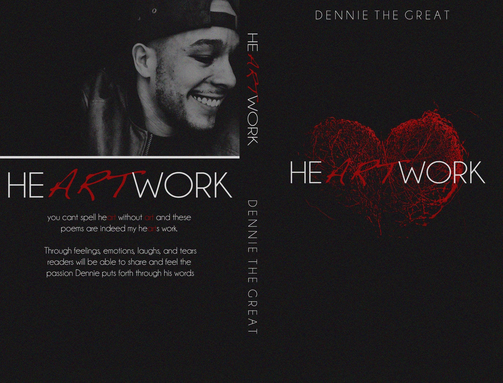

## The README About Nothing 😎

Dennis is a born creative at heart. His creative journey started with attending The Art Institute of Philadelphia as an audio engineer and pivoting into creating music, writing music and publshing a book of spokenword entiiled HeARTwork.

## The Motivation 🙏🏽

How I like to start my day

* Iced Matcha latte or Cold Brew w/ oatmilk
* Unnecessarily loud music 
* BLT (turkey bacon only)
* 30 minutes of exercise
* Sports debate shows

 ## The Connection 🔗

I don't have a personal prefence with communication. If you have a direct way to reach me, use which ever works best for you. Phone calls, text, email, morse code ect. Anytime of day, if im awake or not busy I'll respond asap, scouts honor.

## The Learning Style 👀 

**The Positive Way** 📈 I'm a visual learner. The best way for me to retain information is by seeing a visual demonstration or example and then repetition of practice. 

**The Negative Way** 📉 Reading with out any direction of what i'm doing makes it difficult to retain information. 

## The Feedback 🫵🏽

I prefer to receive direct feedback in a 1-on-1 setting. Don't hold any punches. Brute honesty motivates me. I may not like you in the moment but I'll appreciate it later.

On the otherhand, I tend to be soft when giving feedback. I'm very politically correct and try to protect feelings.

## The Favorite Things 🤌🏽
* Chicken Wings 🍗
* Autum 🍁
* Sneakers 👟
* Writing Music/Poetry 🎤
* Running 🏃🏽‍♂️
* Cooking 👨🏽‍🍳
* Hats 🧢
* Music 🎧
* Sports 🏀
* Flannels 🪵

## The Goals 🥅

My main goal for this year is to add tech to my creative ablities in any aspect. To start my food content creator journey and to write another book.

## The Proudest Accomplishment 🥳

## heARTwork ❤️

