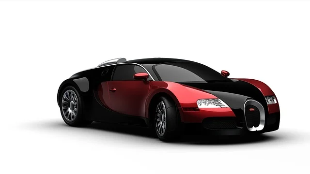

# Oyeyemi JIMOH README.md

## Introduction
I started programming after my high school and got an Associate Degree in computer science thereafter. During the time I was going through the associate degree programme there were very few computers as well as books to read. We rely heavily on whatever the instructor can give and it was really difficult. The programming journey started with C language and the sight of buffer overflow almost took me out of the CS programme. However, after a lot of perseverance, I scaled through.

## Likes
I love learning new languages even though I might not be good at it but always want to have an idea. I love working with others and believe in team work. I enjoy being a servant leader and very ready to treat others with diginity and respect.

## Dislikes
* Laziness  
* Fiddling with cars.

## Hobbies

1. Pair Programming
2. Soccer
3. Gardening
4. Tennis
5. Basketball

## Pictures

</a>
</a>