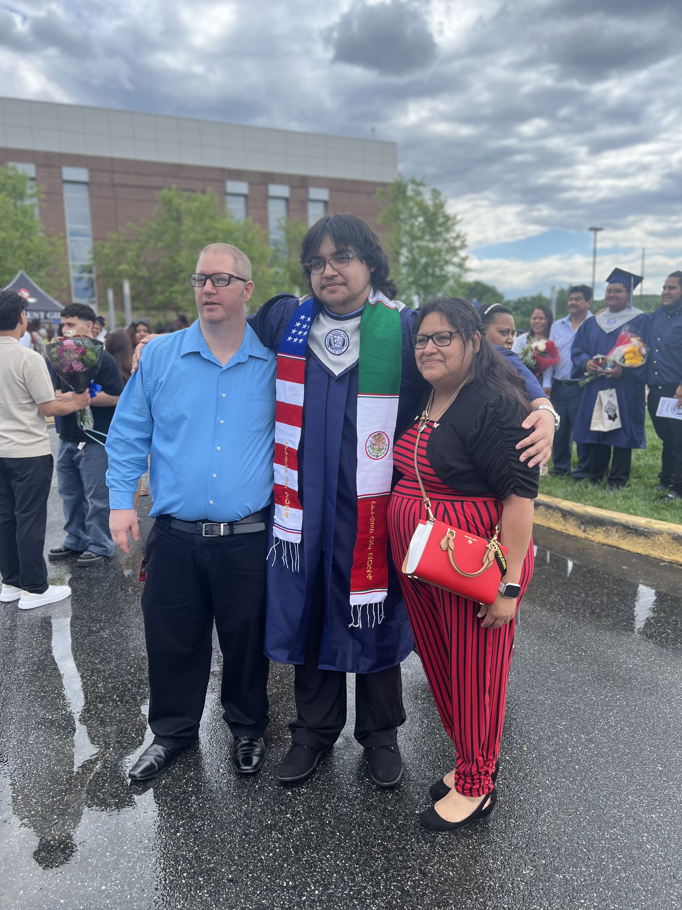

# Shawn Dunsmore Jr README.md

## Introduction 
In the early stages of my life I was very fascinated in how computers work and how they are built which made me want to learn more about them. Around 15 years old I was instructed step by step to build my very first computer going over each parts functions to the computer which sparked my interests even more later through my years I took up a class for coding and wanted to learn about how languages are created and the origin of how they came to be.

## Interests
Things I enjoy to do is video games, reading, watching sports, and playing football. I am a very simple person in what I like im never over the top I like to be simple and fast but apart from those things Those are a few things I enjoy.

## Dislikes
Now I may be simple in my likes I am also simple in my dislikes. Im not a big fan on tennis never could really get into it, don't get me wrong I love sports but tennis I never could seem to get the hand of it. Another dislike of mine is bully's if there is one thing in this world I hate it's bully's couldn't stand them then and I wont tolerate it now.

## Fun Facts
* I can bench 300 pounds on bench press
* I am video game nerd (I love lore in games)
* I am the second in my family graduate from high school
* I have worked with Code Differently for three years

## Photo Gallery Of My Family

</a>
</a>