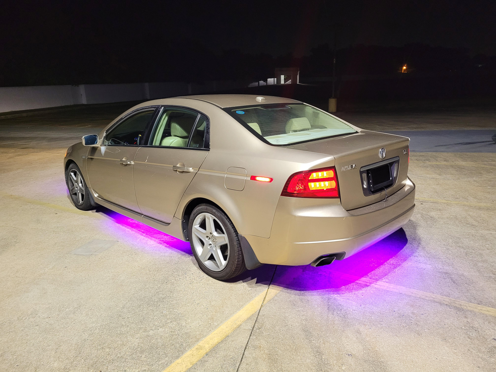
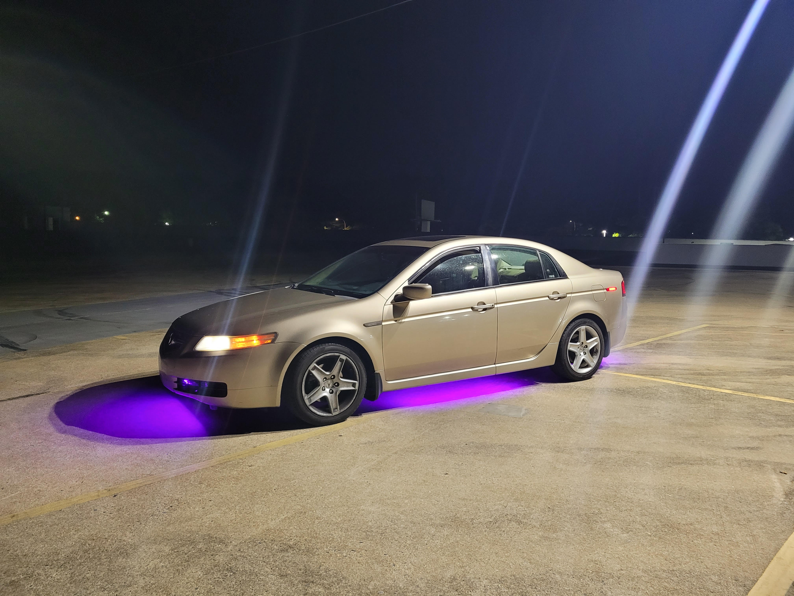

# Xavier Cruz README.md

## Introduction
I started programming when I was fairly young. I was 12 when when I was playing CS:GO when I died to a hacker in game. I obviously got frustrated but besides being mad I found an interest. I wondered how did those cheats work. So I went online and downloaded a cheat and googled a youtube tutorial on how to decipher the source code of the cheat. From there I was entranced with programming. Since I've unlocked that passion I've managed to acquire 2 separate internships at JPMorgan Chase & Co. where I worked on a multitude of backend and frontend systems.

## Likes
I enjoy gaming from time to time, spending time with friends and, meeting new people. I love how different everyone is, not everyone has the same idea on one thing and that to me is very inspiring. Im a big believer in "you can learn new from everyone". This includes people that may not be in your field but they have some life experience or knowledge they are willing to share.

## Dislikes
Nothing much really I think im a fairly chill and understanding person when it comes to a lot of things. A pet peeve of mine would be being interrupted when im deep in thought. I don't hate it but its frustrating to continue where I left off with the same focus as before.

## Hobbies
This kind of ties in with my Likes but im very into
* Cars
* Gaming
* Programming
* Racing

I love working on my car and customizing it to be my personal thing. I think I picked that passion of making things mine from programming coincidentally. Im a big fan of the older Fast and Furious movies and that JDM-esque style. 

I used to love gaming when I was younger. Gaming got me into programming and cars. I used to absolutely love the Midnight Club series. 

Programming is a very big passion of mine for the simple fact that it allows for my creativity to be expressed in a way that I believe is on par with modern arts. Programming in it of itself is an art form.

Lastly I love racing. I occasionally take my car to the track with my friends and we would just race. My car is bone stock except for some general maintenance things (upgraded axles, better starter, alternator, new battery). I currently have underglow installed on my car with no performance modifications so people will say my car is a "ricer". But I like the term ricer because it reminds me of those Fast and Furious cars with all those crazy LEDs everywhere. I own a 06 Acura TL. Since im stock I currently push about 285 HP @ 6200 rpm and 233 lb-ft @ 3500 rpm. I have the auto version which is a 6 speed auto transmission with a sequential mode. Im currently planning on upgrading some of my internals to have a bit more power. Some things im looking to do are

* Forged pistons
* Cold Air Intake
* Better Fuel Rail
* A standalone ECU
* Maybe a Turbo (not sure yet)

## Pictures

</a>
</a>