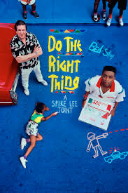

# Yafiah Abdullah README

## Introduction

Hello, my name is Yafiah Abdullah. I am currently finishing my degree in Computer Science at Central State University. While attending Central, I was a student-athlete on the Track & Field team, specializing in Long Jump and Triple Jump. I also have a deep passion for film, with Spike Lee being my favorite director and "Do The Right Thing" as my all-time favorite movie.

## Prerequisites
    
Here are some of the things I need to be a productive citizen and engineer.

*Get plenty of sleep, exercise, and stretch in the morning

*Practice daily prayer

*Use headphones and listen to a great music playlist

*Enjoy nutritious food

## Best Way to Communicate 

1. Email: I prioritize important emails and check my inbox frequently, so I will respond promptly.

2. Text Message: I'm not the fastest at replying to text messages, but I usually respond when I have the time!

## Fun Facts

* I played the Violin
* My first programming language was Java.
* I ran track for almost a decade.
* I love to do outdoors activites
* I also love to cook!

## Photo Gallery

