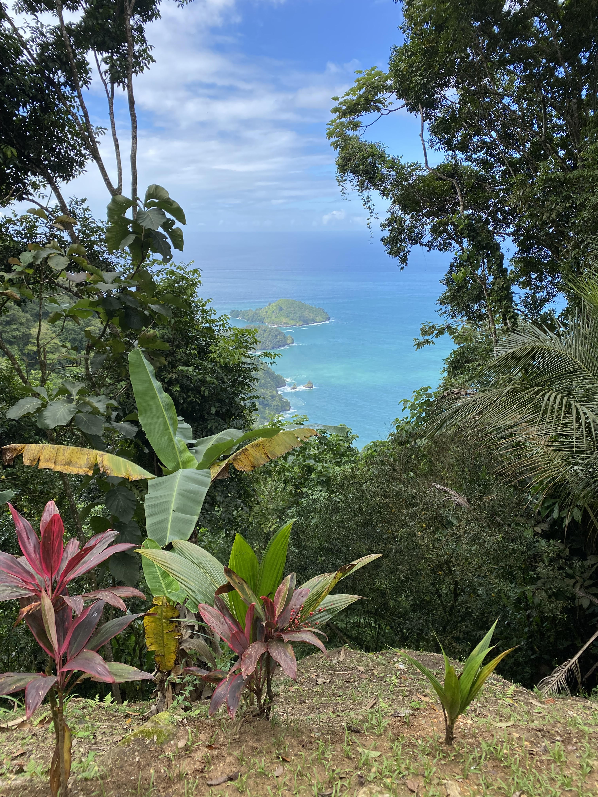

# Zion Buchanan README

## Introduction
Zion Buchanan is a first-generation college graduate with a degree in Organizational Leadership from the University of Delaware. Throughout his academic and professional journey, he has gained diverse leadership experiences. Passionate about exploring new cultures, Zion has traveled extensively, including a transformative trip to Ghana in summer 2022 as part of a leadership development cohort for young Black men. He recently joined a Software Engineering program, where he is committed to developing new skills that can benefit him in his professional endeavors.

## Prerequisites

Here are some things I need that would help me be a productive engineer:
 
- Spending time in prayer, Connecting with God.
- Work/Life Balance: Family/Friends, Going to church, vacation.
- Small breaks throughout the day to prevent burn out.
- A consistent routine/schedule that allows me to recharge: lifting weights, playing basketball/pickleball/swimming.
- Home cooked meals: Rosemary Braised Lamb chops or garlic butter Salmon, with asparagus or brussel sprouts, and a baked sweet potato/oven roasted potatoes.
- A salary of $90k/year salary with opportunities for growth.

## Installation Instructions
- Best time to reach me is between 9am to 5pm. 
- Email is the best method of communication for me, otherwise contacting me via phone.
- I work another job on weekends so I try to get majority or my tasks completed during the week day. 

## Support
I'm open to making connections via LinkedIn.com/in/zionbuchanan/ 

## Fun Facts
- I sing on the church choir
- I enjoy cooking and trying delicous foods
- I aspire to travel the world and vlog my experiences. 
- My favorite color is green

## Photo Gallery

