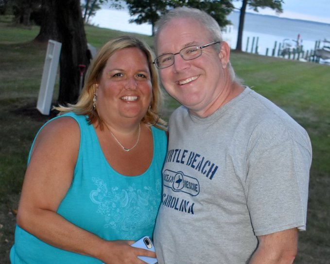
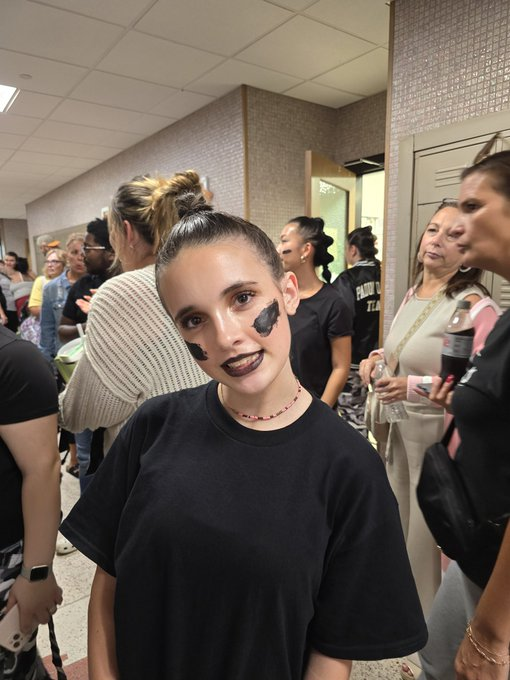

# Carroll Dwight Blue Jr README

## Introduction

Dwight is a widowed father of 2 (12 - son and 15 - daughter) with 10 years experence in hardware technical support and 10 years emergency medical services experence. Dwight was married to Nancy for 17 years before her unexpected passing on August 7th, 2021. Dwight is currently unemployed and concentrating on raising his two kids.

## Prerequisites

Here are some of the things I need to be a productive person and father.

* Dr. Pepper cabinated beverage.
* A good morning from current significant other.
* 80s hair band / country music / musicals soundtracks that are upbeat.
* Favorite foods include Lasagna, Pepperoni Pizza and hamburger Mac and Cheese.

## Installation Instructions

1. To contact feel free to text or call and leave a message do to being extremely busy schedule.
2. I'm am fairly function, just add morning medications.
3. My day prior to starting class, was basic house cleaning including loading / unloading dishwasher, wash / dry / fold / put away cloths.

## Support

* You can find me on LinkedIn, Twitter, and Instagram if you want to reach out. 

## Fun Facts

* I used the original IBM PC in high school.
* My first programming language was BASIC, which I learned at the age of 16. I placed 2nd in a national competition for organization formally known as Office Education Association.
* I have been married twice, first married was from June 9th, 1990 to December 2nd, 1999.

## Photo Gallery

