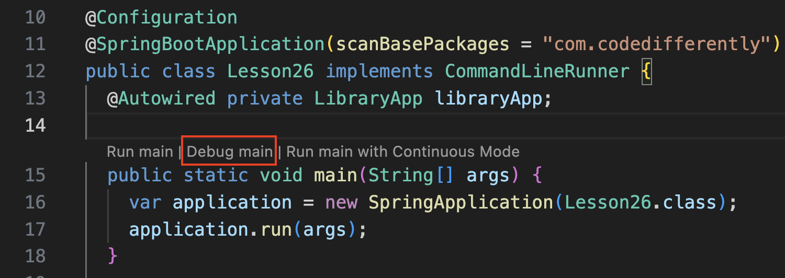

# Lesson 26: Web APIs using REST ([Slides](../slides/#lesson_26))

## Pre-work

Please review the following resources before lecture:

### Required

* [What is HTTP? (Video)](https://www.youtube.com/watch?v=XdWpdDUUbsw)
* [Java REST API in 10 minutes (Video)](https://www.youtube.com/watch?v=m2aqTS3EYnE)
* [1 Min Java Quick Tip | Using the Builder Pattern (Video)](https://www.youtube.com/watch?v=BDYSveH9Q14)

### Recommended

* [Exploring REST APIs with Spring MVC](https://www.developer.com/java/exploring-rest-apis-with-spring-mvc/)
* [Build a REST API with Spring and Java Config](https://www.baeldung.com/building-a-restful-web-service-with-spring-and-java-based-configuration)
* [Using Lombok’s @Builder Annotation](https://www.baeldung.com/lombok-builder)
* See [Lesson 22](/lesson_22/README.md) resources.

## Homework

- [ ] Complete the [Creating a Library API](#creating-a-library-api) assignment.
- [ ] Do pre-work for [lesson 27](/lesson_27/).

### Creating a Library API

We are continuing to build atop the foundation of our library app. For this assignment, you will help implement the API that will be used by a yet-to-come front-end app.

* You will implement the [MediaItemsController][controller-file] to enable the following API:
   * `GET /items` - Retrieves a list of media items
   * `POST /items` - Creates a new media item
   * `GET /items/:id` - Retrieves a single media item with the given ID.
   * `DELETE /items/:id` - Deletes a single media item with the given ID.
* Study the tests in [MediaItemsControllerTest][controller-test-file] to understand what you should accept and return in the API.
* You should not need to make any code changes outside of the `com.codedifferently.lesson26.web` package.

#### Running the API

You can run the server using the usual `./gradlew run` command from the `api/java` directory. If you want to test that the server is running correctly, you can use `curl` like so:

```bash
curl http://localhost:3001/items | json_pp
```

The project also includes an OpenAPI user interface (Swagger) for navigating the API. Just visit http://localhost:3001/swagger-ui.html to access it.

Alternatively, you can also test the API using the tool [Postman][postman-link]. I recommend installing this tool to make it easier to test things.

#### Debugging the API

Remember that you can debug the API by visiting the main function in [Lesson26.java][main-file] and clicking `Debug main`. You'll be able to set breakpoints in your code to see what's happening and fix issues.




#### TypeScript API

This project also includes a fully functioning TypeScript version of the Java project. You can visit `api/javascript/api_app` to execute it using `npm start` and view the OpenAPI documentation at http://localhost:3000/api (note that it runs on port 3000).

## Additional resources

* [gRPC vs REST: Comparing API Styles in Practice (Article)](https://dev.to/anthonydmays/grpc-vs-rest-comparing-api-styles-in-practice-4bl): This article explains why the stuff most people call REST isn't actually.

[controller-file]: ./api/java/api_app/src/main/java/com/codedifferently/lesson26/web/MediaItemsController.java
[controller-test-file]: ./api/java/api_app/src/test/java/com/codedifferently/lesson26/web/MediaItemsControllerTest.java
[postman-link]: https://www.postman.com/downloads/
[main-file]: ./api/java/api_app/src/main/java/com/codedifferently/lesson26/Lesson26.java